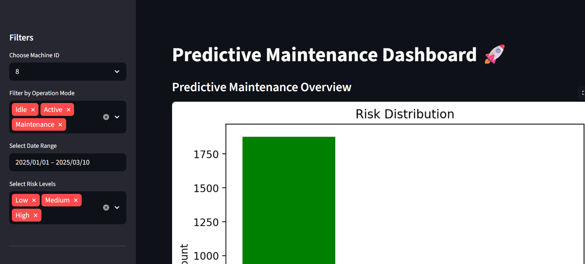
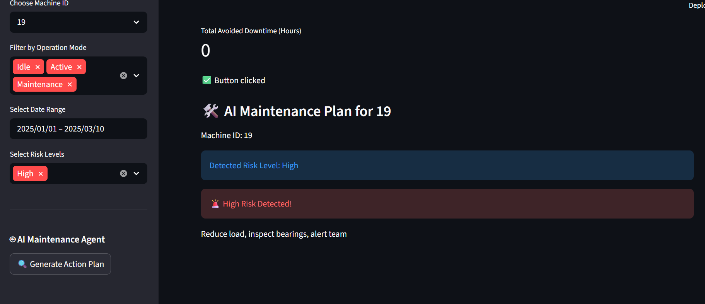
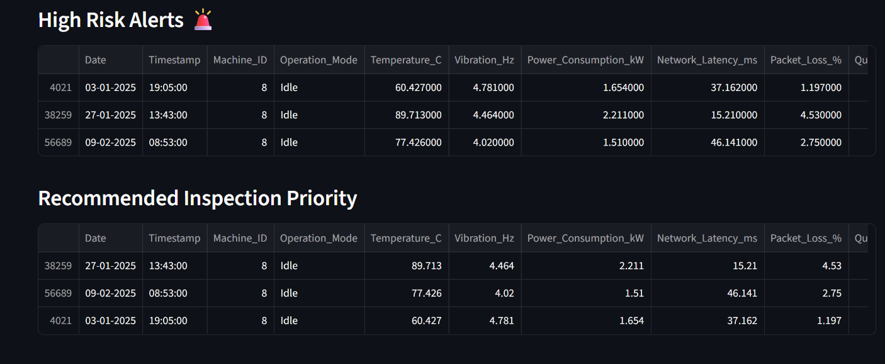

## Predictive Maintenance and Anomaly Detection in Smart Manufacturing

 ## Screenshots

### Dashboard Overview

 ### AI Maintenance Agent

### Risk Distribution

##📌 Overview

This project focuses on building an intelligent predictive maintenance system for smart manufacturing environments. Using machine learning techniques, the system detects anomalies in machine behavior and predicts potential failures before they occur.

##🎯 Objectives

- Detect abnormal machine behavior using sensor data
- Predict maintenance risk levels (Low, Medium, High)
- Provide early warning signals before machine failure
- Enable proactive maintenance decisions

##🧠 Model Used

- Isolation Forest (Anomaly Detection)
- Detects rare and abnormal patterns in machine data

##⚙️ Features

- 📊 Risk distribution across machines
- 📈 Anomaly score trend visualization
- 🚨 High-risk machine alerts
- 🔍 Machine-wise analysis
- 🎛 Interactive filters (Machine ID, Date, Risk Level, Operation Mode)

##📊 Dataset Features

- Temperature, Vibration, Power Consumption
- Error Rate, Maintenance Score
- Network Latency, Packet Loss
- Machine ID, Operation Mode

 ##🤖 AI Maintenance Agent (New Feature)

An intelligent decision-support module that generates real-time maintenance recommendations based on machine risk levels.

 ##🔧 Capabilities
- Detects current machine risk (Low / Medium / High)
- Suggests actionable maintenance steps
- Helps engineers take quick decisions
- Simulates real-world industrial AI assistant

This transforms the system from a monitoring dashboard to an intelligent maintenance assistant.

## 🌐 Live Application

👉 Click here to view the app:
https://mlproject-ulwys6hxkhokmp54rsdnbu.streamlit.app/

##🛠 Tech Stack

- Python
- Pandas
- Scikit-learn
- Matplotlib
- Streamlit

##📌 Project Highlights

- End-to-end ML project
- Real-time interactive dashboard
- Deployed on Streamlit Cloud
- Predictive maintenance approach

##🚀 Future Improvements

- Integration with real-time IoT sensors
- Integration of Agentic AI for autonomous maintenance workflows
- Use of deep learning models (Autoencoders)
- Advanced KPI calculations
- Automated maintenance recommendations

👩‍💻 Author

Manasa S
